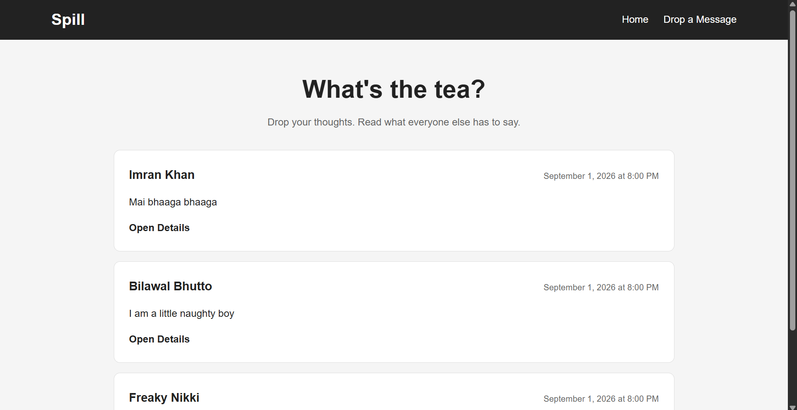
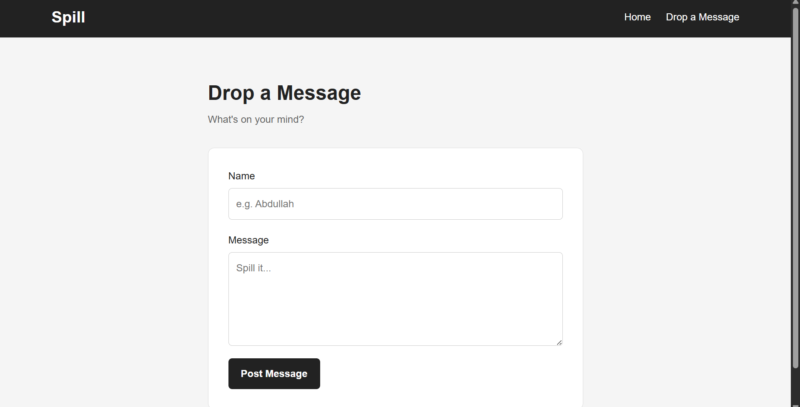
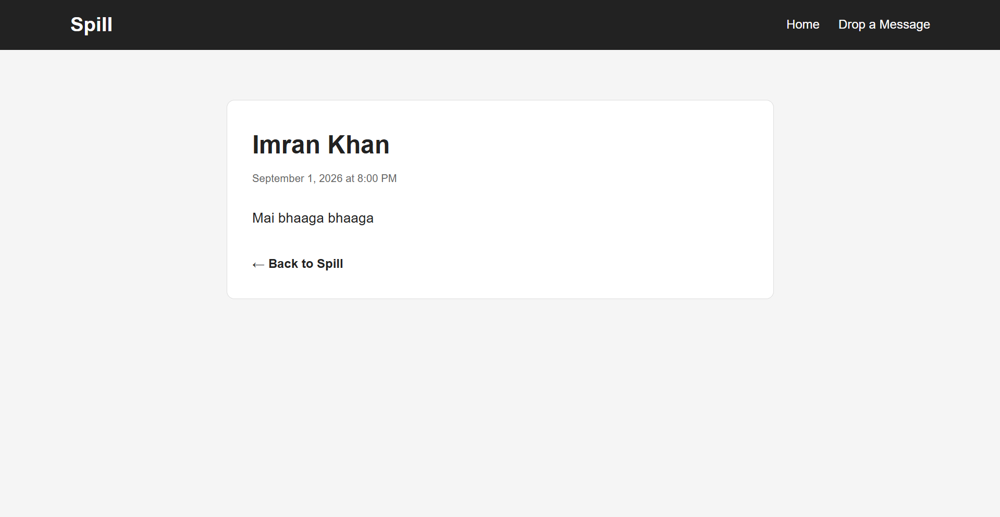

# Spill

Spill is a Node.js and Express-based message board application built around a simple goal: provide a clean and responsive space where users can share messages, browse what others have posted, and view individual messages in detail.

The application uses Express for routing and server-side logic and EJS for server-side rendering of dynamic pages.

## Live Demo

**Live:** https://spill-7wf3.onrender.com

## Screenshots





## Features

* Responsive message board interface
* Displays all available messages
* Allows users to create and submit new messages
* Automatically assigns an ID to each new message
* Displays the author, message content, and timestamp
* Opens individual messages through dynamic routes
* Handles invalid message IDs with a custom 404 error
* Redirects users to the message board after submitting a message
* Server-side rendering with EJS
* Reusable EJS navbar partial
* Form validation using HTML attributes
* Responsive design for desktop, tablet, and mobile
* Interactive hover and focus states
* Semantic HTML structure
* Custom CSS properties for reusable styling values

## Built With

* Node.js
* Express
* EJS
* JavaScript
* HTML5
* CSS3

## What I Learned

This project helped me practice and reinforce:

* Creating and configuring an Express application
* Creating GET and POST routes
* Organizing routes using Express Routers
* Using route parameters with `req.params`
* Handling form submissions with `req.body`
* Using application-level middleware
* Parsing URL-encoded form data with `express.urlencoded()`
* Serving static assets with `express.static()`
* Separating request-handling logic into controllers
* Understanding the basic MVC pattern
* Rendering dynamic pages with EJS
* Passing data from controllers to EJS templates
* Using EJS template syntax and loops
* Creating reusable EJS partials
* Handling redirects with `res.redirect()`
* Creating custom error classes
* Throwing errors from controllers
* Creating Express error-handling middleware
* Using HTTP status codes
* Working with dynamic routes such as `/messages/:id`
* Finding objects in arrays using `Array.find()`
* Working with JavaScript `Date` objects
* Formatting dates and times with `toLocaleString()`
* Structuring and serving static assets using a public directory
* Creating responsive layouts with CSS
* Using Flexbox and CSS Grid
* Using CSS custom properties
* Building responsive forms and navigation

## Project Structure

```text
mini-message-board/
├── controllers/
│   └── indexController.js
├── errors/
│   └── CustomNotFoundError.js
├── public/
│   └── styles.css
├── routes/
│   └── indexRouter.js
├── views/
│   ├── partials/
│   │   └── navbar.ejs
│   ├── form.ejs
│   ├── index.ejs
│   └── message.ejs
├── screenshots/
│   ├── home.png
│   ├── new-message.png
│   └── message-details.png
├── app.js
├── package.json
└── README.md
```

## Installation

Clone the repository:

```bash
git clone https://github.com/abdullahrashid359/mini-message-board.git
```

Navigate to the project directory:

```bash
cd mini-message-board
```

Install dependencies:

```bash
npm install
```

Start the server:

```bash
node app.js
```

Open the application in your browser:

```text
http://localhost:3000
```

## Routes

| Method | Route           | Description                    |
| ------ | --------------- | ------------------------------ |
| GET    | `/`             | Displays all messages          |
| GET    | `/new`          | Displays the new message form  |
| POST   | `/new`          | Creates a new message          |
| GET    | `/messages/:id` | Displays an individual message |

## Error Handling

Spill uses a custom `CustomNotFoundError` class to handle messages that cannot be found.

When an invalid message ID is requested, the controller throws the custom error, which is caught by Express's error-handling middleware and returned with a `404` status code.

## Acknowledgements

This project was completed as part of **The Odin Project** NodeJS course in the Full Stack JavaScript Path.

[The Odin Project – Mini Message Board](https://www.theodinproject.com/lessons/node-path-nodejs-mini-message-board)
